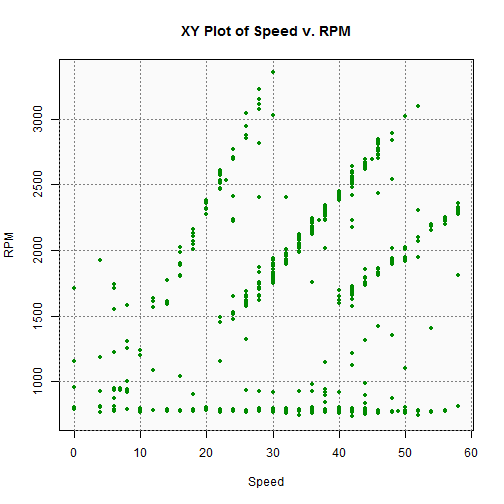
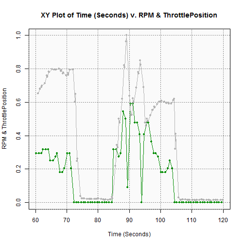

========================================================
# Engine Analysis App
<hr>
## <small>A Simple Engine Parameter Analysis Tool</small>
<br>
<br>
## **Paul Cappa**
### **<small>16 December 2015</small>**

========================================================
# **Introduction**
<hr>
This tool is designed to:

- Perform exploratory data analysis on engine sensor data.
- Compare behavior of two sensors.
- Review up to two sensors over time.
- Observe sensor behavior in one minute time slices.

========================================================
# **The Dataset**
<hr>
### Source
The 7 minutes of data, within the dataset, was captured from a 2005 Honda Civic Hybrid using a simple OBDII data logger.
### Available Engine Parameters

```r
source("global.R")
levels(df$PID.Txt)
```

```
[1] "CoolantTemp"      "ThrottlePosition" "RPM"             
[4] "Speed"            "IntakeTemp"      
```
**"Time"** can also be used on the X Axis.

========================================================
# **Sample Analysis**
<hr>
### Comparing Two Engine Parameters
 

========================================================
# **Sample Analysis**
<hr>
### Comparing Two Engine Parameters over Time
 
